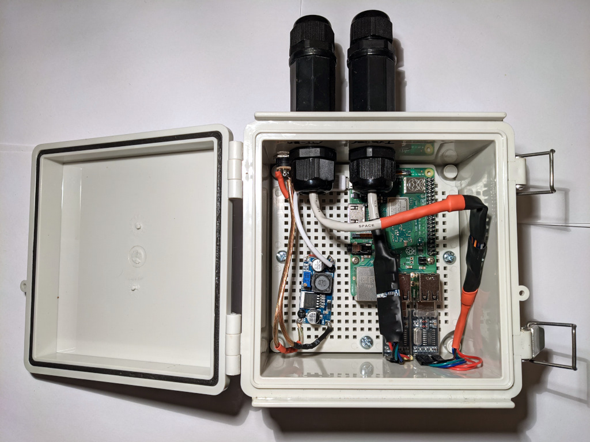
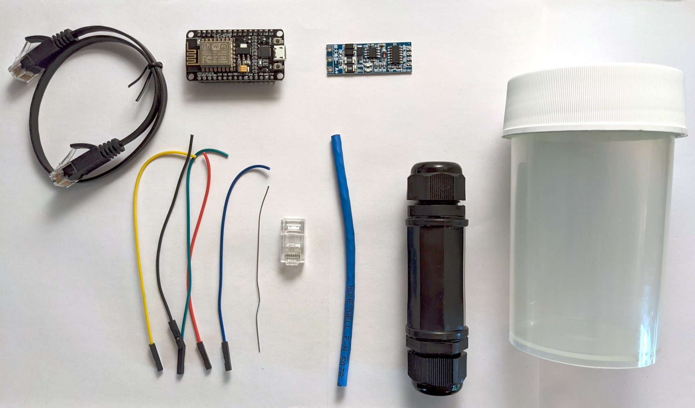
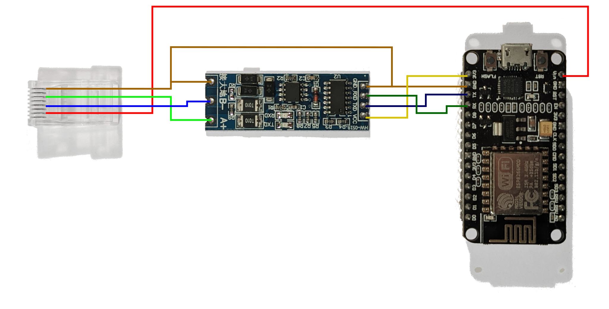
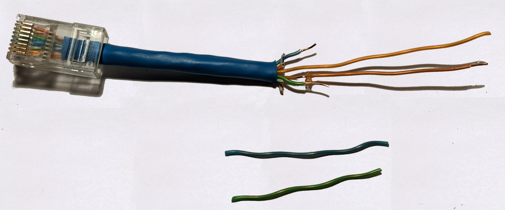
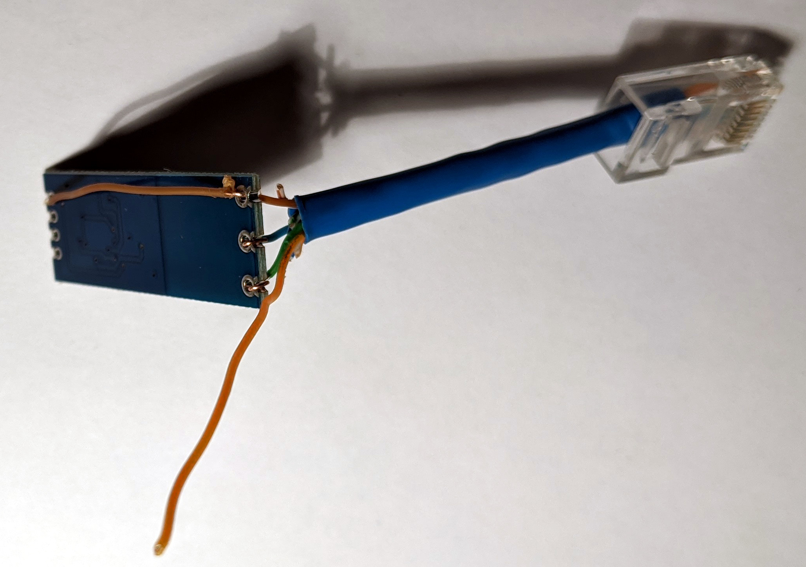
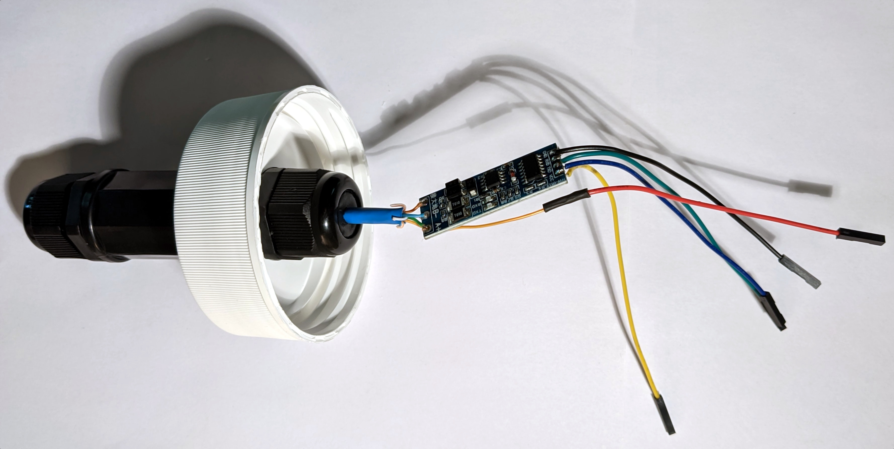
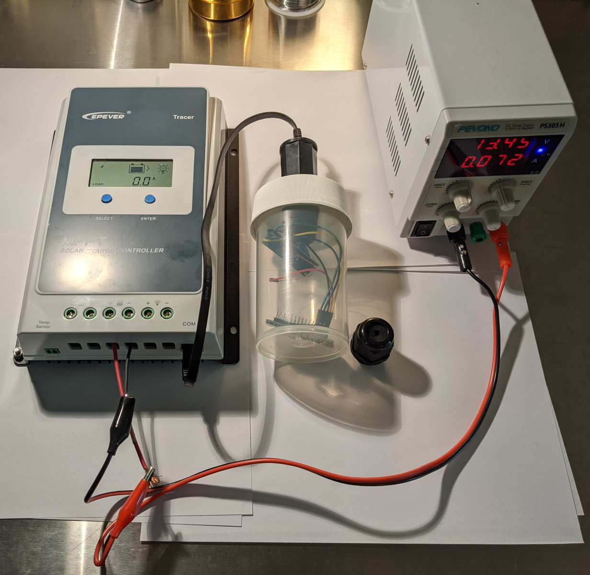

Cheaper MPPT solar charge controllers have become ubiquitous. Many of these sport [RS232](https://en.wikipedia.org/wiki/RS-232) or [RS485](https://en.wikipedia.org/wiki/RS-485)/[Modbus](https://en.wikipedia.org/wiki/Modbus) ports
allowing the controllers to be extended via proprietary hardware/software for advanced monitoring and control use-cases.

Since this Spring I have been experimenting with the EPever (EPSolar) line of MPPT solar charge controllers which have RS485 interfaces and thought it would be worthwhile to share my
learnings in the hope they will be useful to others.

This post will focus on the specific hardware I worked with, however the techniques are applicable to similar hardware.

At the bottom of this post I have linked to similar projects and build logs - while there are many, I believe the content here adds materially in terms of discussing the downsides of using the Raspberry Pi for this application
and, for the esp8266 part of the build, showing the simpler wiring which results from choosing an RS485 adapter which does automatic flow control.

## The First Pi

Early in the Spring I was configuring a couple tiny independent solar systems - one to power networking hardware to get internet on an off-grid property from a local [WISP](https://en.wikipedia.org/wiki/Wireless_Internet_service_provider)
 and another to provide incidental power for the construction phase of my skoolie conversion.

Naturally, I wanted to capture data on the performance of these systems over time to help gain a more intuitive hands-on understanding of the power small "renewable" energy systems can provide. Also
I anticipate the data will be helpful in understanding the aging of the systems' batteries - and possibly panels.

My initial attempts involved a Raspberry Pi 3B and a RS485-to-RS232 adapter. I used a bit of python code and the excellent [epsolar-tracer](https://github.com/Salamek/epsolar-tracer) library to poll the
Tracer 3210AN and publishing metrics to [Carbon/Graphite](https://graphiteapp.org/).

After a fairly steep learning curve with half-duplex RS485 adapters, I got that working and was pleased to have some day-over-day performance data.

At this point my main complaint was that since only one device can connect to the RS485 port at a time, I couldn't have both remote monitoring and the handy [MT-50](https://www.epsolarpv.com/product/55.html) connected simultaneously.

## The Second Pi

I set out to figure out how to get both the local display and remote monitoring working at the same time.

Since the Raspberry Pi only has 1 hardware serial port, I got some [USB serial adapters](https://www.amazon.com/dp/B00LZV1G6K/) and decided to proxy requests from the MT-50 while still polling for data to publish to Carbon.

Proxying the requests was unexpectedly complicated because I discovered that the MT-50 doesn't read data via the [documented modbus commands](http://www.solar-elektro.cz/data/dokumenty/1733_modbus_protocol.pdf).
Most important of the undocumented commands the MT-50 uses is one for reading sparse/discontiguous registers which I have documented in [this gist](https://gist.github.com/symbioquine/95ba2abaf046c8e034b41e4cf3c334a9).

With the protocol bits figured out and a nice watertight box, I had a passable system component which publishes metrics and still allows the local display to work.

Unfortunately, there were still several issues with this strategy;

* Raspberry Pi fail due to how quickly SD cards wear out and result in filesystem corruption - this is supposedly surmountable by limiting or completely disabling writes, but I haven't figured out how to do this while still
  keep the ability to remotely push control-program/OS updates
* Raspberry Pi use quite a bit of energy - over 1 watt [even idle](http://www.pidramble.com/wiki/benchmarks/power-consumption)
* The easiest way I found to securely publish to Carbon was via an SSH tunnel which adds unnecessary complexity and failure-points
* The Raspberry Pi is powered from the 'load' output of the charge controller - meaning the Pi can't be used for toggling power to the load without also turning itself off

## And Now for Something A Little Different

I decided to drop the Raspberry Pi and MT-50 in favor of a much simpler component built around the esp8266. This has a number of advantages;

* Low power - I haven't spent much effort optimizing here, but it seems to be on the order of half a watt under load
* Reliability - there are many fewer points of failure without the complexities of a full OS/filesystem/etc while still supporting remote updates
* 1 plug - since the esp8266 uses so little power, it can powered directly via the charge controller's RS485 port allowing for the unit to remain powered even when the charge controller load output is off

Maintaining the ssh tunnel from the esp8266 didn't seem practical so I switched to publishing the metrics to an authenticated InfluxDB endpoint over HTTPS.

### Materials

* [ESP8266](https://www.amazon.com/dp/B081CSJV2V/)
* [Automatic Flow Control UART to RS485 Converter](https://www.amazon.com/dp/B082Y19KV9/)
* [RJ45 Waterproof Coupler](https://www.amazon.com/dp/B07K7445H5/) - There are probably more cost effective options and the threads are a little fragile on these
* [Nalgene 2118-0008](https://www.thermofisher.com/order/catalog/product/2118-0008) - Any convenient container should also work
* 5 Female jumper wires
* ~4 inches of ethernet cable with one end installed
* Ethernet cable to connect assembled device to the charge controller
* Solder
* Tools

### The Build

Start by stripping about 2" of the outer ethernet cable housing and removing the striped wires. The ground and +5v - brown and orange respectively - are left long while the RS485 A/B wires are trimmed short.

Next the RS485 adapter is grounded.

Then jumper wires are added to the adapter and the whole thing is assembled into the case.

Here is the fully assembled unit connected and powered up.

*Note: for initial programming via USB it is necessary to disconnect the green (RX) wire from the esp8266. After initial programming, OTA updates can be used to avoid that step.*

In a future post I will share some sample code and provide power usage benchmarks.

## Related Work of Others

### Raspberry Pi

* https://www.rototron.info/raspberry-pi-solar-serial-rest-api-tutorial/
* https://stackoverflow.com/a/57351990
* https://www.navitron.org.uk/forum/index.php?topic=26987.0
* https://diysolarforum.com/threads/off-grid-solar-battery-monitoring-and-control-freeware.6662/

### ESP8266

* https://www.eevblog.com/forum/projects/nodemcu-esp8266-rs485-epever-solar-monitor-diy/
* https://www.hackster.io/tekk/cheap-mppt-controller-live-stats-on-mobile-3db5be
* https://www.instructables.com/Wireless-Solar-Charge-Controller-Monitor-RS485-to-/
