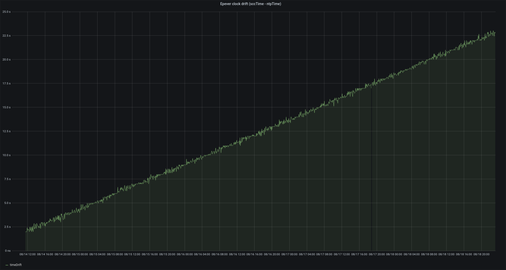
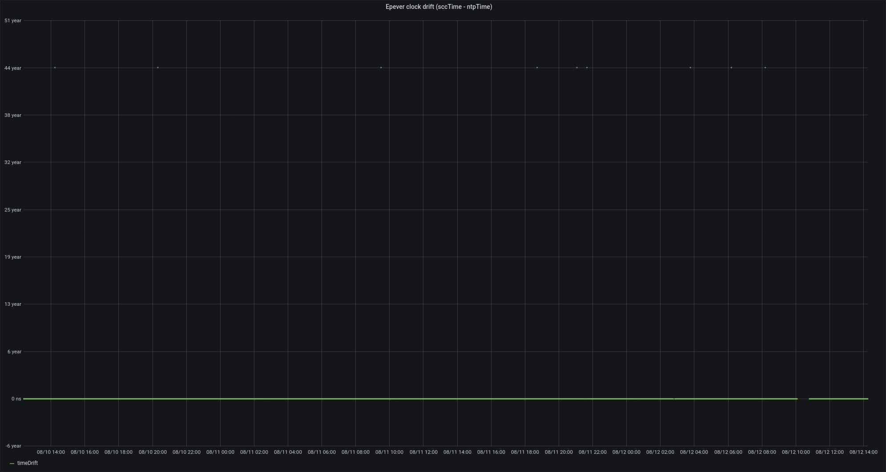
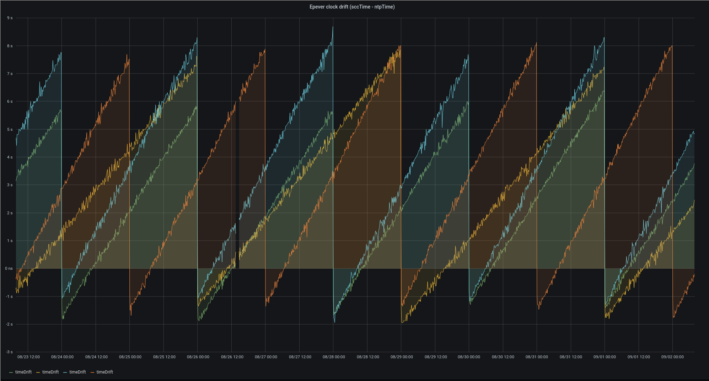

As a follow-up to my [previous post](./2020-10-27-epever-esp-8266-controller) about off-grid solar monitoring via the ESP8266, I am writing this post to share what I've learned about the clock behavior on the EPever (EPSolar) Tracer####AN line of MPPT solar charge controllers.

I have four of these solar charge controllers running all the time each with an ESP8266 publishing metrics back to an InfluxDB instance. The Epever Tracer units provide several features which depend on date/time;

* Time-of-day load control
* Cumulative energy generated/consumed stats
* Periodic equalization charging for lead-acid batteries

My loads are almost always switched on so the first feature is not particularly useful to me, but the other two are. These features make the most sense when the clock on the Epever unit is set accurately. The date/time can be viewed and set manually via the MT-50 external display, or by some other device over Modbus/RS485 - in my case the ESP8266.

If the clock on the Epever units was accurate enough, there wouldn't be much point in automatically correcting it from the ESP8266 since it could just be set upon initial system setup with the MT-50. On the other hand, if the clock was inaccurate, it would be nice to automatically correct it using the time from an NTP server. To understand this, I started capturing a "timeDrift" metric calculated by subtracting the current NTP time from the current time reported by the Epever unit. This new metric showed that the Epever units were consistently running a little fast - ~4s/day.



I would also occasionally get nonsense datapoints where the Epever unit would briefly report a current date/time about 40 years in the past (approx. -1.26 * 10^9).



I believe this to be due to some sort of race condition in how the Epever units read the time from their internal real-time-clock to report it back via Modbus. That hypothesis is reinforced by the observation that the erroneous datapoints tend to fluctuate by 60s and occasionally 3600s - suggesting that the race condition is occurring when a Modbus request for the time coincides with a minute or hour rolling over.

With all those observations in hand, I ended up with some roughly Arduino compatible code that monitors and automatically corrects the Epever unit's clock when it becomes too far out of sync;

```c++
uint16_t pack_as_int(uint8_t v0, uint8_t v1) {
  uint16_t t = (v0 << 8) | v1;
  return t;
}

uint32_t upper_int(uint16_t v) {
  return (v >> 8) & 0xFF;
}

uint32_t lower_int(uint16_t v) {
  return v & 0xFF;
}

bool readDevClock(time_t& devTime) {
  delay(250);
  uint8_t result = node->readHoldingRegisters(0x9013, 0x3);
  if (result != ModbusMaster::ku8MBSuccess) {
    Serial.printf("Failed to read date from charge controller: 0x%02X\n", result);
    return false;
  }

  uint16_t min_and_sec = node->getResponseBuffer(0x0);
  uint16_t day_and_hour = node->getResponseBuffer(0x1);
  uint16_t year_and_month = node->getResponseBuffer(0x2);

  struct tm devTm;

  devTm.tm_year = (upper_int(year_and_month) + 2000) - 1900;
  devTm.tm_mon = lower_int(year_and_month) - 1;
  devTm.tm_mday = upper_int(day_and_hour);
  devTm.tm_hour = lower_int(day_and_hour);
  devTm.tm_min = upper_int(min_and_sec);
  devTm.tm_sec = lower_int(min_and_sec);
  devTm.tm_isdst = -1;

  devTime = mktime(&devTm);

  if (devTime < -1260000000 && devTime > -1270000000) {
    Serial.printf("Received faulty date from charge controller: %04d-%02d-%02dT%02d:%02d:%02dZ\n", devTm.tm_year + 1900, devTm.tm_mon + 1, devTm.tm_mday, devTm.tm_hour, devTm.tm_min, devTm.tm_sec);
    return false;
  }

  return true;
}

void syncClock() {
  time_t devTime0;
  time_t devTime1;

  // Don't record metrics or adjust controller date/time if we can't reliably tell
  // what time it has already set
  if (!readDevClock(devTime0) || !readDevClock(devTime1)) {
      return;
  }

  long int devTimeDelta = devTime0 - devTime1;

  if (devTimeDelta < -10 || devTimeDelta > 10) {
      metricBuffer->appendf(",devTimeDelta=%di", devTimeDelta);
      return;
  }

  time_t currTime;
  time(&currTime);

  // Don't record metrics or adjust controller date/time if somehow we didn't
  // get the correct time from NTP
  if (currTime < 1000000000l) {
      return;
  }

  // Serial.printf("Got date from charge controller: %d-%d-%dT%d:%d:%dZ (currTime = %ld, devTime = %ld, drift = %ld)\n",
  //   devTm.tm_year + 1900, devTm.tm_mon + 1, devTm.tm_mday, devTm.tm_hour, devTm.tm_min, devTm.tm_sec, currTime, devTime, devTime - currTime);

  long int timeDrift = devTime1 - currTime;

  metricBuffer->appendf(",devTime=%di", devTime1);
  metricBuffer->appendf(",currTime=%di", currTime);
  metricBuffer->appendf(",timeDrift=%di", timeDrift);

  struct tm *currTm = localtime(&currTime);

  // Only update controller date/time if it is more than an hour off or we're in the first five minutes of the day
  bool shouldUpdate = abs(timeDrift) > 3600 || (abs(timeDrift) > 5 && currTm->tm_hour == 0 && currTm->tm_min <= 5);
  if (!shouldUpdate) {
      return;
  }

  node->setTransmitBuffer(0, pack_as_int(currTm->tm_min, currTm->tm_sec));
  node->setTransmitBuffer(1, pack_as_int(currTm->tm_mday, currTm->tm_hour));
  node->setTransmitBuffer(2, pack_as_int((currTm->tm_year + 1900) - 2000, currTm->tm_mon + 1));

  uint8_t result = node->writeMultipleRegisters(0x9013, 3);
  if (result == ModbusMaster::ku8MBSuccess) {
    Serial.printf("Successfully set charge controller date/time.\n");
  } else {
    Serial.printf("Failed to set charge controller date/time: 0x%02X", result);
  }
}
```

Which yields the following nice behavior where all four of my controllers are consistently drifting by about 4s per day and having their clocks updated approximately every other day at midnight;



In the future I hope to share more of my learnings about monitoring/controlling cheap off-grid solar charge controllers - and perhaps a more complete firmware at some point too.

Thanks for reading!