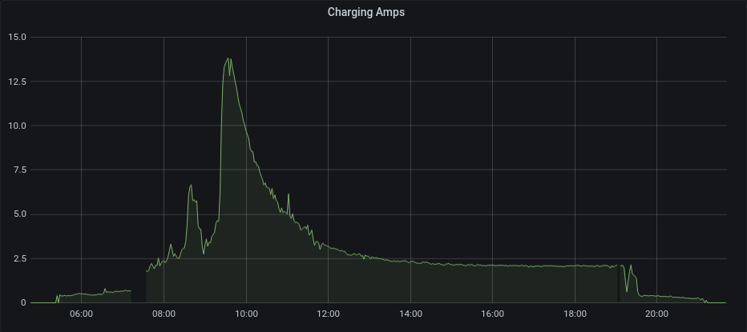
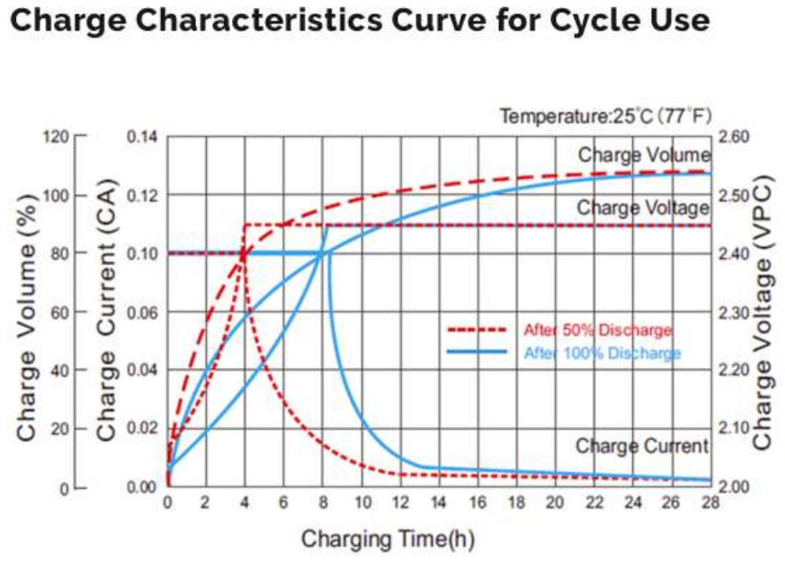

Recently I spent some time analyzing an off-grid system for some less technical family members. In trying to understand and explain why it wasn't performing as they expected, I gained a greater appreciation for the nuances of lead acid (LA) battery charging characteristics and how they affect off-grid systems - especially those systems with insufficient solar capacity and those in less equatorial latitudes.

There are many other articles describing the care and feeding of LA batteries ([here is one of my favorites](https://www.sevarg.net/2018/04/08/off-grid-rv-lead-acid-maintenance-charging-failure-modes/)) so I will try to go beyond just reiterating the conventional wisdom about LA battery life being inversely proportional to the depth of discharge (DoD). I'm instead going to focus on one of the most important off-grid system characteristics which I think is both crucial and often neglected. That characteristic is **charging time**. (*Actually, reputable battery manufacturers often **do** provide specifications/guidance that are both detailed and tailored to their products, but for whatever reason that information - and the consequences thereof - doesn't seem to be well represented more generally.*)

All batteries have maximum rates at which they can safely charge. For LA batteries, the charging rates are usually specified by the manufacturer either in terms of a number of hours in bulk and absorption charging or in terms of a graph showing the state of charge (SoC) vs charging power and time. Regardless of how much solar capacity a system has, it will tend not to fully charge the batteries unless the system has long enough with sufficient power for charging from a given average DoD.

You've probably seen the characteristic charge curve of LA batteries where the charging amperage - and total power - tapers off dramatically before the batteries are full.

*The above graph is showing a Renogy 200 Ah AGM charging from a 10% DoD on 2021/07/05.*

That roughly matches the manufacturer's charging characteristics graph.

That charging curve is both a blessing and a curse. It means up to around 80% of the capacity can be regained at roughly the maximum charge rate - usually around 10-13% (of the 20 hour capacity rating) for FLA and closer to 20% for AGM. However, it also means that batteries are often cycled in a lower average SoC range than one might expect. For example, if you tend to use 30% of your battery capacity over night and only have 4 hours of charging time during the day, you will probably be cycling your batteries between 50% and 80% instead of 70% and 100% - even assuming the system has plenty of solar panels.

There are a number of approaches to mitigating/solving this problem;

1. Shifting loads to the day time if/when there is excess solar capacity.
2. Reducing usage such that - on average - there are enough hours of solar to charge when taking into account the battery charge curve.
3. Performing a portion of the bulk charge using generator power in the morning before the "solar charging day" begins.
    * This yields the best value for the time spent running a generator since most generators are most efficient between 40% and 70% of their rated output.
4. Increasing the size of the LA battery bank.
    * This will allow the same amount of usage while staying at a higher SoC - which in turn means staying farther down the tail end of the charging curve.
5. Shifting loads to other battery technologies.
    * The cheap/easy version of this is similar to #1 where one just charges laptops/phones/etc during the day when there is excess solar capacity.
    * This could also be a strategy for moving to another battery technology altogether. For example, by using a [DC-DC charger](https://www.amazon.com/dp/B085G72RQ2) configured to charge a secondary LiFePo4 battery bank to which loads and batteries are added incrementally.
 
Hopefully this post has served to highlight the importance of considering charging time as a key aspect of off-grid load management and battery sizing. May your systems be performant, long lasting, and boring.

