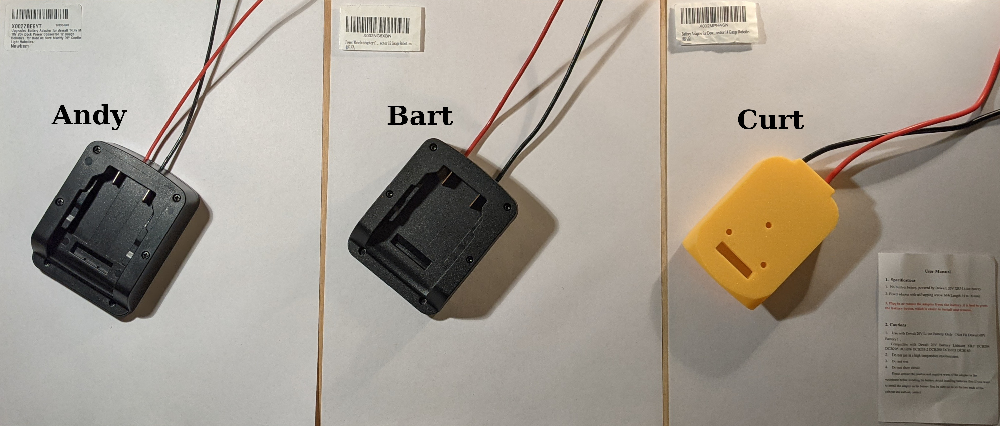
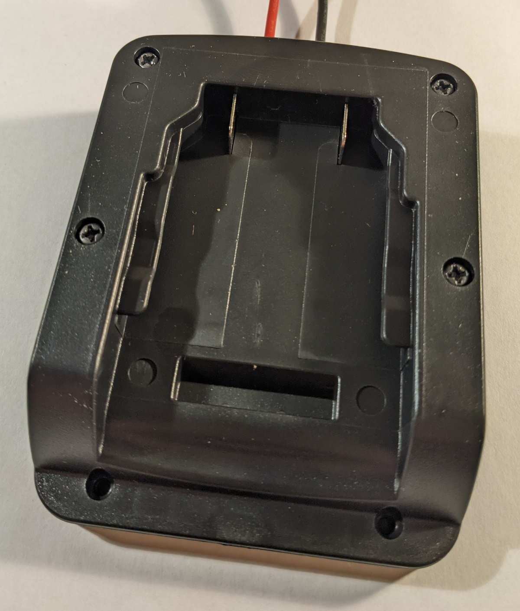
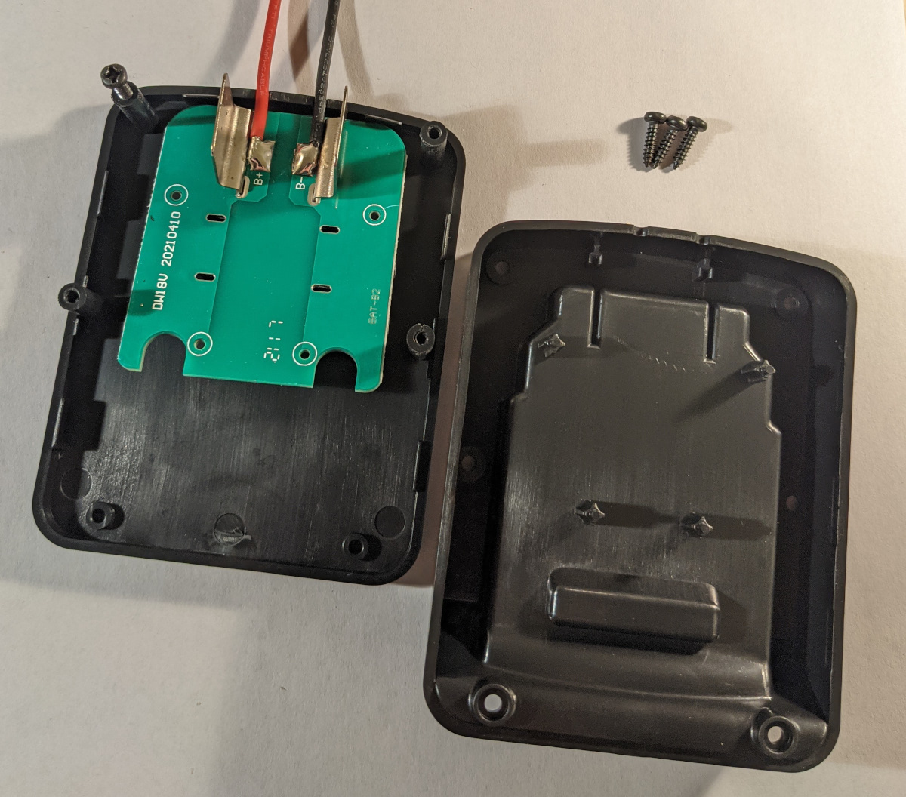
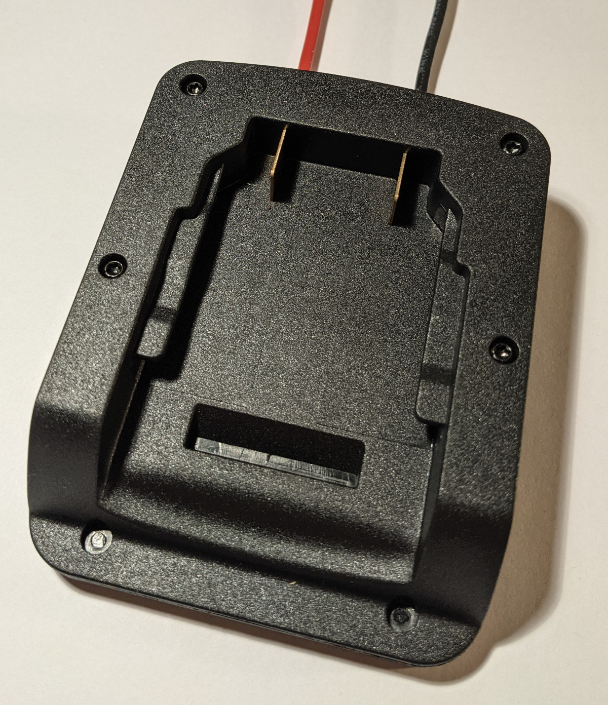
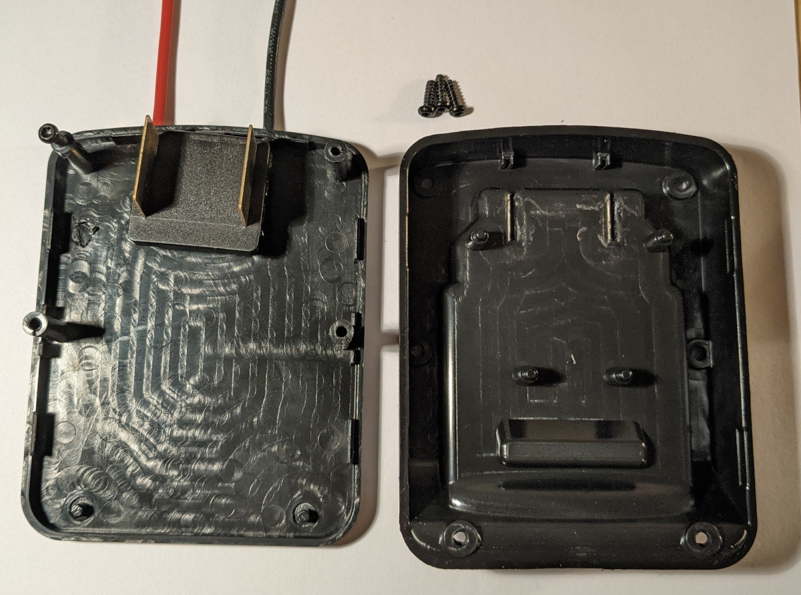
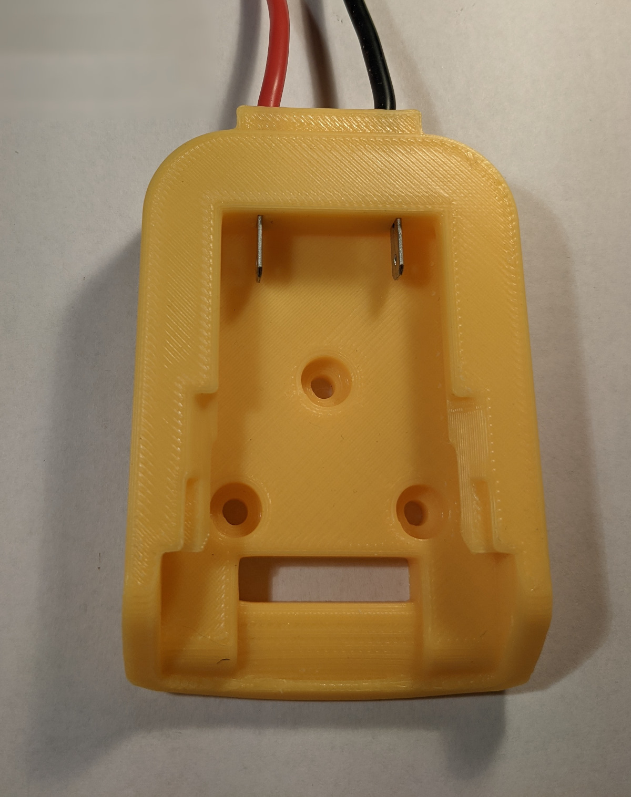

While I don't intend to make this blog reviews-focused, some products have the potential to be foundational to a wide range of alternative DIY projects which I would like to help
make more viable.

Many DIY projects require a simple reliable high-capacity power source. While dedicated or built-in batteries sometimes make sense, sourcing high-quality cells is often difficult.
Also, as the number of such devices with dedicated batteries grows, so does the effort needed to keep them all charged on a semi-regular basis. As such, small tool batteries -
like those for power tools by Makita, DeWalt, etc - make a compelling option. Here I will review 3 similar DeWalt adapters so other folks can hopefully just buy the one that best
suites their project best.

There are probably at least a dozen of these adapters on Amazon, and even more listings on Ebay and AliExpress. I picked 2 of the ones with the most/best reviews and one that seemed
to be newly listed but which claimed to have over current/voltage/charge/heating protection.

Since the adapters are so similar, I'll refer to them by the names Andy, Bart, and Curt.

* Andy: "Power Wheels Adaptor for dewalt 20V" https://www.amazon.com/dp/B09C5CXVDM
    - $12.58 - 4.6 stars with 1,114 ratings and 82 reviews
* Bart: "Upgraded Battery Adapter for dewalt" https://www.amazon.com/dp/B08JLYPY4F
    - $8.09 - 4.5 stars with 3 ratings and zero reviews
* Curt: "Battery Adapter for Dewalt 20V" https://www.amazon.com/dp/B08GWZ8LR6
    - $10.58 - 4.6 stars with 498 ratings and 40 reviews

## Breakdown

### Andy

 

#### Pros

* Attaches to battery securely, detaches only when battery release button is pressed, and appears to be making a solid electrical connection with battery terminals
* Plastic and mechanical portion is sturdy and fits together cleanly
* Has a very simple "circuit board" inside to hold the contacts - this could be convenient for some kinds of mods
* Wires are very well soldered to board
* 200 C Fluorinated Ethylene Propylene (FEP) wire insulation

#### Cons

* No strain relief for wires
* Thin contacts
* Wire does not match description - actually is 14 awg not 12 awg
* Wire has a relatively low strand count and is pretty stiff - not ideal for applications which will experience frequent bending
* 3g over advertised weight of 70g

### Bart

 

#### Pros

* Attaches to battery securely, detaches only when battery release button is pressed, and appears to be making a solid electrical connection with battery terminals
* Plastic and mechanical portion is sturdy and fits together cleanly
* Held together with nicer T9 screws compared with the philips screws found on Andy
* Slightly thicker contacts than Andy
* Right at advertised weight of 67g
* Actually has 12 gauge wire - as advertised
* Wires are directly soldered to the flat battery contacts - Could potentially increase overall ampacity
* 200 C Fluorinated Ethylene Propylene (FEP) wire insulation
* Has some internal space that could be used in some projects to house additional small electronics

#### Cons

* No strain relief for wires - though they do feed through small holes in a way that may provide some protection compared to Andy
* Product images falsely advertise the adapter as having "Multiple Protection" ("Over-current", "Overvoltage", "Over-Charge", and "Over-Heating"), but actually there is nothing in the adapter that would provide that
* Contacts are embedded in floating a piece of plastic and rely on the assembled case to capture them in the right position
* Wire has a relatively low strand count and is pretty stiff - not ideal for applications which will experience frequent bending
* I partially stripped two of the screws doing the investigation for this review - probably not really the fault of the adapter since they're not meant to be taken apart very many times

### Curt

#### Pros

* Attaches to battery securely, detaches only when battery release button is pressed, and appears to be making a solid electrical connection with battery terminals
* Plastic and mechanical portion is sturdy and appears to be a single piece - not counting the contacts and wire
* Actually has 12 guage wire - as advertised
* Wire is a high strand count which should hold up better to frequent bending than the other adapters
* Wires are directly soldered to the flat battery contacts - Could potentially increase overall ampacity
* Wire insulation says 200 C and is nice and flexible/rubbery - might be silicone
* Has nice countersunk screw holes for attaching the adapter to things
* Lightest of the adapters at 56g

#### Cons

* No strain relief for wires
* Thin contacts - similar to those on Andy but a little more fragile due to their smaller size and reduced contact area with the case of the adapter
* Contacts are a little loose and could potentially pull out of the adapter
* Product images could be misleading since they contradict the description and suggest the adapter comes with 14 awg wire (it is actually 12 awg - see "pro" above)
* 6g over advertised weight of 50g

## Other Take-aways

* None of these adapters have a means of low voltage discharge cutoff - and [neither do the batteries](https://www.sevarg.net/2017/04/22/dewalt-20v-max-60ah-pack-teardown/) - so that will need to be part of any projects that use these adapters.
* None of these adapters have connections for the other balance leads so they can't be (safely) used for charging.
* None of these adapters are suitable for rough applications due to the lack of strain relief and wiring that will stand up to abuse.

## Conclusion

* Andy is nice if you plan to mod the adapter and put additional electronics inside - especially for low-current applications or if you plan to redo the wiring anyway
* Bart is probably the best value and likely has the highest continuous current carrying capacity
* Curt is probably the best for applications where weight matters or where the wire will experience frequent bending

**Bottom line:** For most projects I would probably pick Bart.
