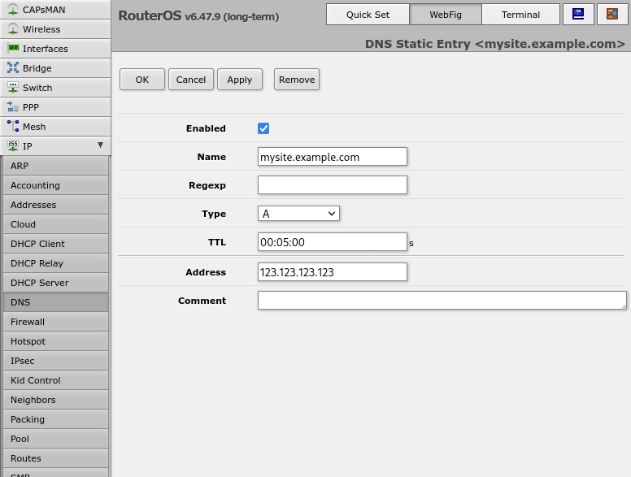
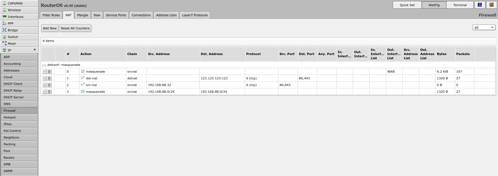
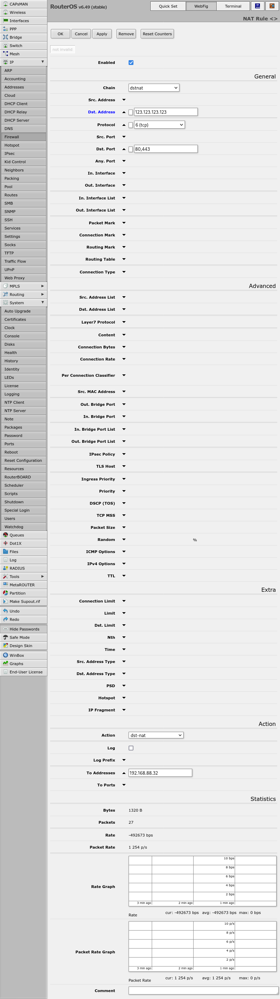
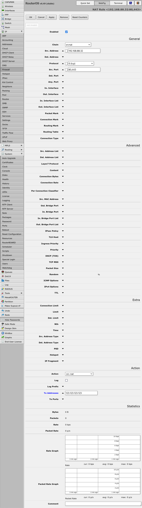
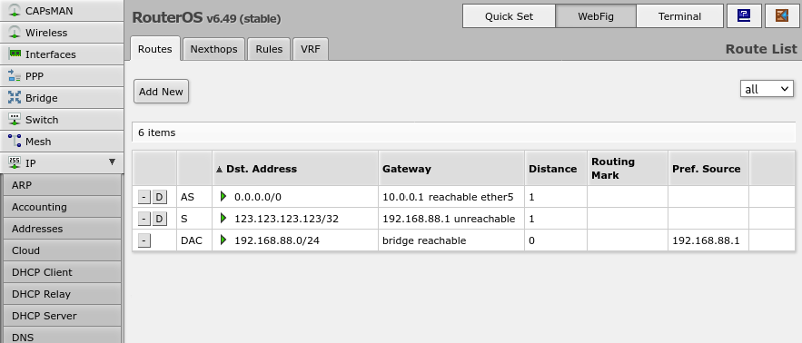

While "The Cloud" has dramatically changed the landscape of hosted computing, there are still some scenarios where it is compelling to self-host and particularly self-host on ones own hardware and network.

Prominent among these scenarios is the case where the the application needs to be resilient to outages such that it remains locally accessible even if the wider Internet is not available.

One way to achieve that while still making the application accessible via the public Internet is to reverse tunnel ports 80 and 443 from a remote server server to the local one. Then use a local gateway firewall to
route IP packets bound for the remote server and those ports to the local server directly. In this way devices on the local network will transparently get the benefits of local network performance/availability without
needing to differentiate at the DNS/IP layer - which causes issues for devices like phones that may automatically switch between the local network and the public Internet via their cell connections.

### Remote Server Setup

The only things that should be needed are to enable your SSH key in the remote server's `authorized_keys` file and to enable OpenSSH's `GatewayPorts` option.

That might look something like this;

```sh
cat cumulus.pub >> ~/.ssh/authorized_keys
sudo sh -c "grep -q '^[^#]*GatewayPorts' /etc/ssh/sshd_config && sed -i '/^[^#]*GatewayPorts[[:space:]]no/c\GatewayPorts yes' /etc/ssh/sshd_config || echo 'GatewayPorts yes' >> /etc/ssh/sshd_config"
```

I would also recommend disabling `ChallengeResponseAuthentication` and `PasswordAuthentication` in OpenSSH;

```sh
sudo sh -c "grep -q 'ChallengeResponseAuthentication' /etc/ssh/sshd_config && sed -i '/^[^#]*ChallengeResponseAuthentication[[:space:]]yes.*/c\ChallengeResponseAuthentication no' /etc/ssh/sshd_config || echo 'ChallengeResponseAuthentication no' >> /etc/ssh/sshd_config"
sudo sh -c "grep -q '^[^#]*PasswordAuthentication' /etc/ssh/sshd_config && sed -i '/^[^#]*PasswordAuthentication[[:space:]]yes/c\PasswordAuthentication no' /etc/ssh/sshd_config || echo 'PasswordAuthentication no' >> /etc/ssh/sshd_config"
```

### Local Server Setup

*Note: This assumes there is a folder `certs/` with `fullchain.pem` and `privkey.pem` files for the "mysite.example.com" domain and also that there is an OpenSSH private key for the remote host in a file named `cumulus.privkey`.*

**docker-compose.yml**

```
version: '3.7'
services:

  www:
    image: crccheck/hello-world
    restart: always
    expose:
      - '8000'

  proxy:
    depends_on:
      - www
    image: nginx:latest
    restart: always
    volumes:
      - './nginx.conf:/etc/nginx/nginx.conf'
      - './certs/mysite.example.com:/etc/nginx/certs/mysite.example.com'
    ports:
      - '80:8080'
      - '443:8443'

  autossh-forward-proxy-http-to-cumulus:
    image: jnovack/autossh:2.0.0
    environment:
      - SSH_MODE=-R
      - SSH_REMOTE_USER=root
      - SSH_REMOTE_HOST=123.123.123.123
      - SSH_REMOTE_PORT=22
      - SSH_BIND_IP=0.0.0.0
      - SSH_TUNNEL_PORT=80
      - SSH_TARGET_HOST=localhost
      - SSH_TARGET_PORT=80
    restart: always
    privileged: true
    network_mode: "host"
    volumes:
      - ./cumulus.privkey:/id_rsa

  autossh-forward-proxy-https-to-cumulus:
    image: jnovack/autossh:2.0.0
    environment:
      - SSH_MODE=-R
      - SSH_REMOTE_USER=root
      - SSH_REMOTE_HOST=123.123.123.123
      - SSH_REMOTE_PORT=22
      - SSH_BIND_IP=0.0.0.0
      - SSH_TUNNEL_PORT=443
      - SSH_TARGET_HOST=localhost
      - SSH_TARGET_PORT=443
    restart: always
    privileged: true
    network_mode: "host"
    volumes:
      - ./cumulus.privkey:/id_rsa
```

**nginx.conf**

```
pid        /tmp/nginx.pid;
error_log  /var/log/nginx/error.log warn;

events {

}

http {
  client_body_temp_path /tmp/client_temp;
  proxy_temp_path       /tmp/proxy_temp_path;
  fastcgi_temp_path     /tmp/fastcgi_temp;
  uwsgi_temp_path       /tmp/uwsgi_temp;
  scgi_temp_path        /tmp/scgi_temp;

  client_max_body_size 200m;

  server {
    listen 8080;
    server_name mysite.example.com;

    rewrite ^/(.*)$ https://$host$request_uri? permanent; 
  }

  ssl_certificate     /etc/nginx/certs/$host/fullchain.pem;
  ssl_certificate_key /etc/nginx/certs/$host/privkey.pem;

  server {
    listen 8443 ssl;
    server_name mysite.example.com;

    location / {
      proxy_pass http://www:8000;

      proxy_set_header Host $host;
      proxy_set_header X-Real-IP $remote_addr;
      proxy_set_header X-Forwarded-For $proxy_add_x_forwarded_for;
      proxy_set_header X-Forwarded-Proto https;
    }

  }

}
```

### Networking Setup

*Note: These instructions are for Mikrotik routerOS, but something similar should be possible with most full-featured router/firewall hardware.*

```
/ip dns static
add address=123.123.123.123 name=mysite.example.com ttl=5m
/ip firewall nat
add action=masquerade chain=srcnat comment="defconf: masquerade" ipsec-policy=out,none out-interface-list=WAN
add action=dst-nat chain=dstnat dst-address=123.123.123.123 dst-port=80,443 protocol=tcp to-addresses=192.168.88.32
add action=src-nat chain=srcnat protocol=tcp src-address=192.168.88.32 src-port=80,443 to-addresses=123.123.123.123
add action=masquerade chain=srcnat dst-address=192.168.88.0/24 src-address=192.168.88.0/24
/ip route
add distance=1 dst-address=123.123.123.123/32 gateway=192.168.88.1
```










