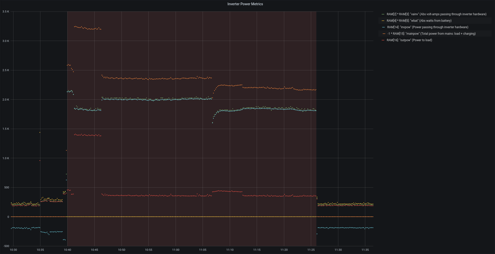
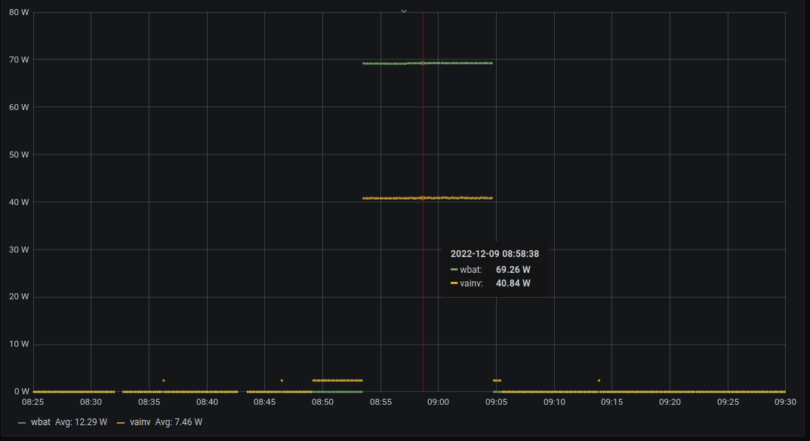

I am lucky enough to have a pair of Victron MultiPlus inverters (Multi(s) hereafter). Originally, I just had one hooked up and kept the other as a backup - I
have semi-critical loads like a freezer that would be wasteful/costly in the event of a prolonged outage. However, recently our winter charging needs dictated
that charging faster via the generator was in order - this provides extra flexibility, keeps the noise down for our neighbors, and ~~I suspect~~ yields better
generator efficiency (more on that in another post). Thus for me, hooking up the second Multi was an obvious next step.

This post will describe some things I have learned about the Multi's data protocols and how I've been using them to monitor our generator usage.

Originally, I had a very simple script to pull data using a library Victron references in their 
[open source link-farm](https://www.victronenergy.com/live/open_source:start#multis_quattros_mk2), [izak/ib.victron](https://github.com/izak/ib.victron)
(izak/ib.victron hereafter). It's not clear if that library is still being maintained and it has some other issues - e.g. [still on Python
2](https://github.com/izak/ib.victron/pull/3), only supports a single bus device properly, and makes a few assumptions which break with the current version of
the protocol. I don't want to beat up on that library too much because it served me well for a year and helped me understand the protocol immensely. Just that
my use-case outgrew it. In addition to sharing what I've learned here, I hope to eventually share the library I've written as a spiritual successor to
izak/ib.victron.

Unfortunately, Victron puts their protocol documentation behind an email form so I can't share a direct link, but the relevant documentation can be found quite
easily by requesting "Interfacing with VE Bus products - MK2 protocol" from [Victron's Technical information downloads 
page](https://www.victronenergy.com/support-and-downloads/technical-information). The rest of this post will reference version 3.14 of that documentation, 
however I will try to provide enough detail so having that documentation in-hand isn't essential.

### Bus vs Device Communication

Multi's (and some other Victron devices) have RJ45 ports (the same physical ports used for ethernet) which are used to chain one or more devices together into
a single physical communication "bus". This bus (VE.Bus) is used by the devices themselves to coordinate parallel/split-phase/multi-phase operation and by 
monitoring/control hardware/software. In order to access the bus from a computer, a special USB adapter ([MK3-USB](https://www.amazon.com/dp/B06Y5WS3VZ/)) is
used to translate between the bus transport and expose it as a serial interface.

On the software side, Victron calls the protocol for interfacing with the bus "MK2". Messages in the MK2 protocol are called "frames". Most of these messages 
take the form of a command/response pattern where devices wait for frames which request information or make changes, then respond with the requested
information or confirmation/errors. There are two broad categories of commands, commands which pertain to the bus as a whole, and "Winmon" commands which
pertain to specific devices only.

The izak/ib.victron library mainly only exposes the bus-level information. Interestingly, a lot of the bus-level information can't be interpreted without also
requesting supporting data from the individual bus devices. The rational for this doesn't seem to be documented in the protocol. Nor does it seem to be
documented whether, in systems with several Multis, it is valid to use the supporting data from the first device to interpret the the bus-level information for
all the devices - we kind of have to assume so, but it feels like a major gap in the protocol documentation.

Another gap in the protocol documentation seems to be in terms of the meaning of parts of the bus-level information when multiple devices are hooked up.
Specifically, I was interested in the steady-state power cost of having two inverters hooked up all the time. With one inverter, I had been monitoring the DC
power usage as as measured by the inverter and it seemed to match up with the baseline power usage for my system as a whole. When I hooked up the second
inverter though, I was puzzled since that bus-level power usage number didn't appear to double. I still can't totally explain that phenomena (I will touch on
the phenomena in a later section to describe what I do know, but - as I say - it's still unexplained.) It is that quandary that sent me down the path of
trying to monitor the DC power usage for each inverter independently.

In the MK2 protocol, there is a bus-level address command which is used to set or retrieve the address of the device to which subsequent Winmon commands are
directed. The izak/ib.victron library allows an address to be specified, but only once and only one address. It doesn't allow switching between devices on the
fly and although it provides a primitive locking mechanism which would appear to allow multiple instances to work with the same bus, there isn't any logic
to track which device is currently being addressed so it isn't really viable to use as-is for sending Winmon commands to multiple bus devices.

### Device Discovery

The MK2 documentation also describes how to discover which devices are on the bus. This is done by iteratively selecting addresses and testing whether a
response is received when issuing a Winmon command. The izak/ib.victron library doesn't handle this at all.

Interestingly, the MK2 protocol documentation doesn't clarify whether the result of this device discovery should be assumed to be valid for the entire life
of a bus connection. In the case of my inverters I'm assuming so - since they're set up to switch as a group, meaning they can't be disconnected without
interrupting all the devices and I don't have any more VE.Bus devices to connect.

### Device RAM Snapshots

The MK2 protocol documentation suggests that, to get accurate point-in-time power data, one can issue a bus-level command to snapshot up to 6 specific RAM
variables, then read the data from that snapshot on each device. The available RAM IDs appear to correspond pretty closely to data that is also available via
the bus-level info commands, but the mapping between the two isn't explicitly described in the documentation.

### Poorly Documented RAM Variables

Along similar lines, some of the RAM variables have cryptic or misleading descriptions. Specifically, RAM variables 14 and 15 appear to have the exact same
description, but return different values. Presumably, folks at Victron who wrote the documentation copied and pasted between the two variables' descriptions
but forgot to update one of them.

By recording both of these and looking at them both with and without the generator running, I think I can explain what they actually mean.

* `RAM[2] * RAM[3]`: "vainv" (Abs volt-amps passing through inverter hardware)
* `RAM[4] * RAM[5]`: "wbat" (Abs watts from battery)
* `RAM[14]`: "invpow" (Power passing through inverter hardware)
* `RAM[15]`: "mainpow" (Total power from mains: load + charging)
* `RAM[16]`: "outpow" (Power to load)

In the above graph I have multiplied "outpow" (`RAM[15]`) by `-1` to make it easier to see how it is the sum of the load power plus the charging power. In my
installation, this value is always zero or less, indicating power flowing from my generator to charge the batteries and power loads. I don't know whether there
are scenarios where a positive value is possible, but we can surmise it might indicate power flowing back to mains - perhaps where power is being feed back to
the grid.

I included "vainv" (the product of `RAM[2] * RAM[3]`) and "wbat" (the product of `RAM[4] * RAM[5]`) for comparison. I suspect the small differences where vainv
is always a little higher than "invpow" (`RAM[14]`) are the result of my loads' power factor being slightly less than one - the three RAM values were captured
as part of the same snapshot. Similarly, the difference between the inverter power and "wbat" should show us the overhead or self-consumption of the inverter.

Finally, "outpow" (`RAM[16]`) is pretty self-explanatory. It is just the power actually used by loads on the AC output of the Multis and does not seem to
effected by whether the inverter hardware is charging or inverting. (Except for the edge case I'll describe next...)

### Missing Background Power Usage

As mentioned earlier, I was surprised to see that the zero-load usage of the new inverter was zero which didn't match the specification sheet, nor my experience
with the first inverter. After much experimenting with the metrics side of things, I finally decided to stick a clamp ammeter on the cable to the inverter and
found around 0.95 amps @ 26.5v DC with zero load - literally nothing connected to the output. Since that didn't appear in any of the metrics, I next tested with
a known load by putting a 40 watt incandescent light bulb directly on the terminals. Immediately, the Multi started reporting that it was consuming 69 watts from
the battery which is much more like what I was expecting. Thus in my present configuration it appears the second Multi has an idle power draw in the range of 30
watts, but has trouble self-reporting that usage unless there is also some AC load current flowing.

I will probably work around this discrepancy in the future by just shifting some of my loads on to the other split-phase leg and then not worry about it.

### Monitoring Generator Usage

For a while now I've been tracking my generator usage. This helps me understand the ongoing costs of my off-grid system. Some interesting efficiency data has
come out of that which will probably be the subject of another post, but the part I want to discuss here is the actual monitoring mechanism because that is based
on the metrics from the Multis and my learnings above.

In my system all generator power flows through the Multis which charge the batteries and also pass power through to my AC loads. There are several advantages to
this configuration:

* It eliminates the need for a transfer switch since the Multis can do that internally - seamlessly switching from inverter to pass-through modes as needed
* The Multis can automatically manage the max generator current such that the charging rate is attenuated when large loads come on
* The Multis provide a common point where many of the key usage metrics can be measured

To that last point, I can then have a tiny service which utilizes the learnings above to poll the Multis and write the relevant metrics into InfluxDB. Those
raw metrics are available in a dashboard, but also are available for analysis purposes. In this case, I have a script which reads the data from InfluxDB and
outputs the generator run time and kWh produced for each instance the generator is run.

I'll probably share the actual code for doing that in a future post, but for now, I'll just outline how it works. The script pulls 1 minute data for the last week
and looks for datapoints where the inverter is charging instead of drawing power from the batteries. For those time periods it tracks the total runtime and sums
the 1 minute averages of the power used to charge and power passing through to the loads.

The resulting data can help with understanding the generator's performance characteristics - i.e. at what average loading do we get the most kWh per unit of
generator fuel. It also is a convenient way to track generator run hours which is useful for scheduling maintenance tasks like oil changes and filter cleaning.

### Conclusion

I don't know what the ideal intersection is for open source/knowledge with proprietary upper-mid-teir hardware like Victron. Clearly, there is an argument for
Victron funding more first-party open source tooling and improving their documentation to disambiguate some of the points that I've highlighted above. At
the same time I appreciate that there exists *some* documentation, and admire the scrappy nature of the community open source projects they've linked to.

I hope that this post is helpful to others who want to gain access to detailed inverter metrics and attain a deeper understanding of the behaviour their systems.
Perhaps it will inspire people to share their learnings and library improvements.

More generally, I am optimistic that the sum of the broader hacker/tinkerer communities' efforts with various alternative/renewable/off-grid energy systems and
components will yield a more robust and adaptable technical ecosystem. That in turn could allow folks to build systems they can afford and which reward
conserving resources. Acknowledging of course that in many/(most?) cases, if available, standard grid power will probably be the cleanest and cheapest option
overall.

Happy New Year and happy/safe hacking!
